# OZON Similar Products

Проект для построения блока **«Похожие товары»** на основе поведения пользователей Ozon Fresh.

Система формирует для каждого товара список похожих товаров: тех, которые часто встречаются рядом с ним в
пользовательских сессиях, имеют достаточно сильные поведенческие сигналы и проходят базовые правила качества.

## Что делает проект

Проект решает задачу рекомендаций вида «товар → похожие товары».

На вход подаются пользовательские события и информация о товарах. На выходе получается таблица рекомендаций, которую
можно использовать для проверки результата или как основу для виджета похожих товаров.

| Что                                  | Формат                                              |
|--------------------------------------|-----------------------------------------------------|
| Основной идентификатор товара в коде | `item_id`                                           |
| Итоговый формат для виджета          | `sku \| similar_items_sku_list`                     |
| Основной результат                   | список похожих товаров для каждого исходного товара |
| Тип решения                          | пакетный пересчёт по временному окну                |

В коде проекта используется колонка `item_id`, потому что так товар называется в локальных данных. В финальной выгрузке
результат можно привести к формату из постановки задачи: `sku | similar_items_sku_list`.

## Основная идея

Мы считаем товары похожими не только по категории или названию, а по поведению пользователей.

Если разные пользователи часто смотрят, кликают, добавляют в избранное или кладут в корзину два товара в рамках одной
сессии, между этими товарами появляется связь. Чем чаще и сильнее такие связи, тем выше товар-кандидат попадает в
рекомендации.

```mermaid
flowchart LR
    A[Сырые события пользователей] --> B[Очистка событий]
    B --> C[Построение сессий]
    C --> D[Пары товаров внутри сессий]
    D --> E[Агрегация пар за период]
    E --> F[Расчёт оценки похожести]
    F --> G[Выбор лучших кандидатов]
    G --> H[Резервные рекомендации и правила качества]
    H --> I[Итоговые рекомендации]
    I --> J[Получение похожих товаров по item_id]
```



## Почему выбран такой подход

Поведенческий граф хорошо подходит для первой рабочей версии, потому что он:

* объясним: товар попал в рекомендации, потому что пользователи часто взаимодействовали с ним рядом с исходным товаром;
* не требует ручной разметки похожих товаров;
* работает на реальных логах поведения;
* позволяет постепенно улучшать качество через веса действий, нормализацию, резервные рекомендации и оценку качества;
* может быть расширен более сложными методами, например товарными эмбеддингами или отдельной моделью ранжирования.

## Какие действия считаются сигналами

В проекте используются товарные действия пользователей:

* `view` — просмотр товара;
* `click` — клик по товару;
* `favorite` — добавление в избранное;
* `to_cart` — добавление в корзину.

До этапа расчёта итоговой оценки эти действия хранятся отдельно. Это важно: проект не смешивает все сигналы в одно число
слишком рано. Сначала сохраняются факты, а итоговая оценка похожести появляется только в отдельном слое расчёта.

## Что создаётся после запуска

После запуска формируются основные артефакты:

```text
outputs/runs/<run_id>/
  recommendations/
    detailed.parquet
    enriched.parquet
    lookup.parquet
  manifest.json

outputs/latest/
  recommendations/
    detailed.parquet
    enriched.parquet
    lookup.parquet
  manifest.json
```

Главные файлы:

| Файл               | Зачем нужен                                                                |
|--------------------|----------------------------------------------------------------------------|
| `detailed.parquet` | подробные рекомендации с оценкой, позицией и диагностическими полями       |
| `enriched.parquet` | рекомендации с дополнительной информацией о товарах                        |
| `lookup.parquet`   | компактный формат для быстрого получения похожих товаров                   |
| `manifest.json`    | параметры запуска, даты периода, пути к результатам и служебная информация |

Файл `outputs/latest/manifest.json` указывает на последнюю опубликованную версию результата.

## Быстрый запуск

### 1. Установить зависимости

Проект использует `uv`.

```bash
uv sync
```

### 2. Подготовить данные

Исходные архивы нужно положить в папку:

```text
data/raw/archives/
```

Ожидаемые архивы:

```text
product_information.tar.gz
user_actions.tar.gz
```

Подготовить данные в формате parquet:

```bash
uv run python scripts/prepare_raw_data.py
```

Проверить структуру проекта и наличие данных:

```bash
uv run python scripts/check_project_structure.py
```

### 3. Построить рекомендации

```bash
uv run python scripts/run_pipeline.py 2024-04-23 --lookback-days 7 --top-k 20 --config-path configs/baseline.yaml
```

### 4. Запустить полный сценарий с оценкой качества

```bash
uv run python scripts/run_full.py 2024-04-23 --lookback-days 1 --validation-days 1 --top-k 20 --config-path configs/production.yaml
```

В этом режиме проект сначала строит рекомендации на обучающем периоде, а затем проверяет качество на следующем временном
периоде.

### 5. Посмотреть результат

```bash
uv run python scripts/preview_latest_recommendations.py
```

Посмотреть рекомендации для конкретного товара:

```bash
uv run python scripts/preview_latest_recommendations.py --item-id 113
```

## Как устроен проект

Текущая версия состоит из нескольких независимых слоёв.

| Слой                    | Ответственность                                                                       |
|-------------------------|---------------------------------------------------------------------------------------|
| `EventCleaner`          | очищает пользовательские события и оставляет товарные действия                        |
| `SessionBuilder`        | группирует действия пользователей в сессии                                            |
| `ItemPopularityBuilder` | считает популярность товаров и распределение действий                                 |
| `ItemPairBuilder`       | строит пары товаров внутри сессий                                                     |
| `PairAggregator`        | агрегирует пары за выбранный период                                                   |
| `CoVisitationScorer`    | рассчитывает итоговую оценку похожести                                                |
| `TopKSelector`          | выбирает лучшие товары-кандидаты для каждого исходного товара                         |
| `FallbackLayer`         | добавляет резервные рекомендации для товаров, которым не хватило поведенческих данных |
| `RecommendationWriter`  | сохраняет подробный и компактный результат                                            |
| `SimilarItemsLookup`    | читает готовые рекомендации и возвращает похожие товары                               |

## Структура репозитория

```text
OZON-Similar-products/
  configs/                   # параметры запуска, данных, оценки качества и подбора параметров
  data/                      # локальные данные, не коммитятся в Git
  docs/                      # подробная документация
  notebooks/                 # исследовательские ноутбуки
  scripts/                   # команды для запуска основных сценариев
  src/ozon_similar_products/ # основной Python-пакет
  outputs/                   # результаты запусков, не коммитятся в Git
  tests/                     # тесты
```

Основные модули пакета:

```text
src/ozon_similar_products/
  data/           # чтение данных, схемы, валидация
  preprocessing/  # очистка событий и построение сессий
  features/       # популярность товаров и служебные статистики
  retrieval/      # пары товаров, агрегация, оценка похожести, выбор кандидатов
  business/       # резервные рекомендации и правила качества
  evaluation/     # метрики и отчёты по качеству
  output/         # сохранение рекомендаций и служебной информации
  serving/        # получение готовых рекомендаций
  diagnostics/    # диагностика данных и переиспользуемые проверки
  pipeline/       # управление полным запуском
  cli/            # точки входа для командной строки
```

## Настройки

Основные параметры вынесены в YAML-файлы.

```text
configs/
  paths.yaml
  data.yaml
  baseline.yaml
  production.yaml
  evaluation.yaml
  tuning/
    search_space.yaml
```

Через настройки задаются:

* даты и размер временного окна;
* список товарных действий;
* параметры построения сессий;
* ограничения для построения пар товаров;
* веса и калибровка оценки похожести;
* количество рекомендаций для каждого товара;
* резервные рекомендации;
* метрики качества;
* пространство подбора параметров.

## Оценка качества

Качество рекомендаций проверяется на будущих действиях пользователей.

Идея простая: проект строит рекомендации на одном временном периоде, а затем проверяет, встречались ли рекомендованные
товары в действиях пользователей в следующем периоде.

Основные группы метрик:

| Группа                         | Что показывает                                                 |
|--------------------------------|----------------------------------------------------------------|
| Метрики ранжирования           | насколько хорошо рекомендации попадают в будущие действия      |
| Метрики по типам действий      | качество отдельно по `view`, `click`, `favorite`, `to_cart`    |
| Покрытие                       | для какой доли товаров удалось построить рекомендации          |
| Метрики резервных рекомендаций | насколько часто и насколько полезно срабатывает резервный слой |
| Диагностика популярности       | не доминируют ли в рекомендациях слишком популярные товары     |

Для бизнес-смысла особенно важны метрики, связанные с `to_cart`, потому что добавление в корзину является более сильным
сигналом интереса, чем простой просмотр.

## Подбор параметров

Для подбора параметров используется отдельный сценарий:

```bash
uv run python scripts/run_tune.py 2024-04-23 --lookback-days 1 --validation-days 1 --top-k 20 --config-path configs/production.yaml --search-space-path configs/tuning/search_space.yaml --max-trials 30 --tuning-strategy random
```

Результаты сохраняются в:

```text
outputs/tuning/<sweep_id>/
  results.csv
  best_config.yaml
  best_metrics.json
```

После анализа лучшую конфигурацию можно вручную перенести в `configs/production.yaml`.

## Тесты и проверки

Запустить все тесты:

```bash
uv run pytest
```

Проверить стиль кода:

```bash
uv run ruff check src scripts tests
```

Проверить типы:

```bash
uv run pyrefly check src scripts tests
```

## Что уже реализовано

В текущей версии реализован рабочий конвейер обработки:

* чтение и подготовка parquet-данных;
* очистка событий по дневным разделам;
* потоковое построение сессий;
* перенос активных сессий между днями;
* построение компактных дневных статистик по парам товаров;
* агрегация пар за выбранный период;
* расчёт популярности товаров и статистик по типам действий;
* расчёт оценки похожести;
* выбор лучших рекомендаций;
* слой резервных рекомендаций;
* сохранение подробного и компактного результата;
* служебный файл с параметрами запуска;
* просмотр готовых рекомендаций;
* оценка качества на отложенном периоде;
* подбор параметров.

## Ограничения текущей версии

* Проект рассчитан на пакетный пересчёт, а не на мгновенную онлайн-выдачу.
* Слой резервных рекомендаций является MVP-реализацией и требует отдельной оптимизации для очень больших каталогов.
* Качество рекомендаций зависит от плотности пользовательских событий.
* Проект пока не использует персонализацию под конкретного пользователя.
* Более сложные методы, например товарные эмбеддинги или отдельная модель ранжирования, рассматриваются как следующий
  этап развития.

## Документация

Подробная документация лежит в `docs/`.

Рекомендуемый порядок чтения:

1. `docs/README.md` — карта документации.
2. `docs/architecture.md` — архитектура проекта.
3. `docs/data_contract.md` — контракты таблиц и границы ответственности.
4. README внутри модулей `src/ozon_similar_products/` — описание конкретных слоёв.
5. Документы по оценке качества, резервным рекомендациям и подбору параметров — детали проверки и настройки решения.

## Коротко

Проект строит похожие товары через поведенческий граф:

```text
товарные действия пользователей
→ сессии
→ пары товаров
→ оценка похожести
→ лучшие рекомендации
→ резервные рекомендации
→ получение готового списка похожих товаров
```

Главный принцип реализации: **сначала сохраняем факты о поведении, потом отдельно считаем оценку похожести и только
после этого формируем итоговые рекомендации**.
