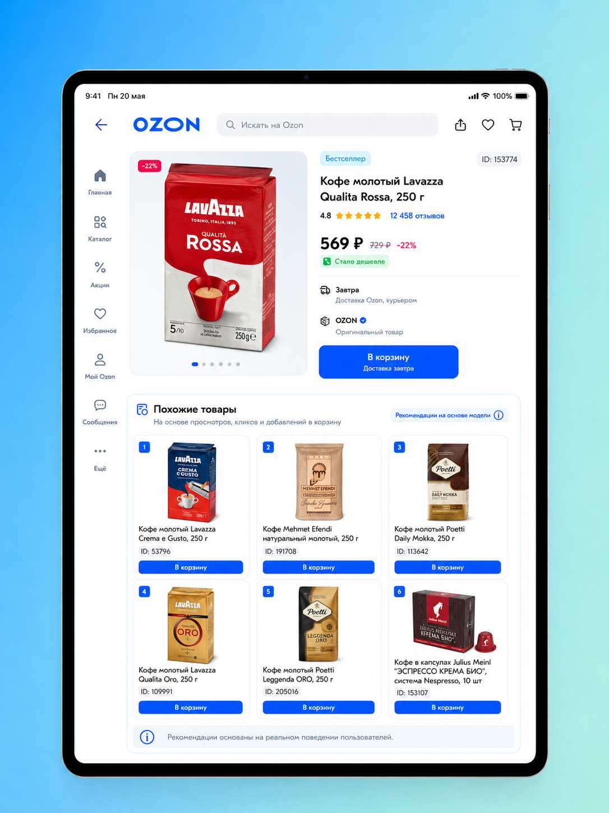

# OZON Similar Products

Проект строит блок **«Похожие товары»** на основе поведения пользователей Ozon Fresh.

На вход подаются пользовательские события и информация о товарах. На выходе получается список похожих товаров для
каждого исходного товара: его можно анализировать, проверять offline-метриками или использовать как основу для
рекомендательного виджета.

## Демонстрация результата

Проект строит похожие товары по действиям пользователей: просмотрам, кликам, добавлениям в избранное и добавлениям в
корзину.

Ниже показан демонстрационный макет того, как результат модели может выглядеть в карточке товара.



*Демонстрационный макет интерфейса. Товары и `item_id` взяты из выходных артефактов пайплайна; изображение показывает,
как результаты модели могут быть использованы в карточке товара.*

## Быстрый запуск

### 1. Установить зависимости

Проект использует `uv`.

```bash
uv sync
```

### 2. Подготовить данные

Исходные архивы должны лежать в папке:

```text
data/raw/archives/
```

Ожидаемые архивы:

```text
product_information.tar.gz
user_actions.tar.gz
```

Подготовить данные:

```bash
uv run python scripts/prepare_raw_data.py
```

Проверить структуру проекта и наличие данных:

```bash
uv run python scripts/check_project_structure.py
```

### 3. Построить рекомендации

```bash
uv run ozon-run-pipeline 2024-04-23 --lookback-days 7 --top-k 20 --config-path configs/baseline.yaml
```

### 4. Посмотреть результат

```bash
uv run ozon-preview-recommendations
```

Посмотреть рекомендации для конкретного товара:

```bash
uv run ozon-preview-recommendations --item-id 113
```

### Demo UI

Для интерактивного просмотра рекомендаций можно открыть Streamlit-приложение:

```bash
uv run streamlit run apps/demo/app.py
```

Приложение позволяет искать товар по `item_id` или названию, выбирать случайный товар, смотреть похожие товары,
источники рекомендаций и сведения о запуске.

### 5. Запустить полный сценарий с оценкой качества

```bash
uv run ozon-run-full 2024-04-23 --lookback-days 1 --validation-days 1 --top-k 20 --config-path configs/production.yaml
```

Полный сценарий сначала строит рекомендации на обучающем периоде, а затем проверяет качество на следующем временном
периоде.

## Что делает проект

Проект решает задачу:

```text
товар → список похожих товаров
```

Общая идея:

```text
товарные действия пользователей
→ сессии
→ пары товаров
→ оценка похожести
→ top-K рекомендаций
→ fallback
→ готовый lookup
```

Главный принцип реализации: сначала проект сохраняет факты о поведении пользователей, затем отдельно считает оценку
похожести и только после этого формирует итоговые рекомендации.

Подробнее:

* [архитектура проекта](docs/architecture.md);
* [контракты данных](docs/data_contract.md);
* [README модуля `retrieval`](src/ozon_similar_products/retrieval/README.md);
* [README модуля `pipeline`](src/ozon_similar_products/pipeline/README.md).

## Что появляется после запуска

Основные результаты сохраняются в `outputs/`.

```text
outputs/runs/<run_id>/
  recommendations/
    detailed.parquet
    enriched.parquet
    lookup.parquet
  demo/
    graph/
      recommendations_graph.html
      recommendations_graph.json
      recommendations_graph.gexf
      manifest.json
  manifest.json

outputs/latest/
  recommendations/
    detailed.parquet
    enriched.parquet
    lookup.parquet
  manifest.json
```

Главные файлы:

| Файл               | Зачем нужен                                                                |
|--------------------|----------------------------------------------------------------------------|
| `detailed.parquet` | подробные рекомендации со score, rank и диагностическими полями            |
| `enriched.parquet` | рекомендации с дополнительной информацией о товарах                        |
| `lookup.parquet`   | компактный формат для быстрого получения похожих товаров                   |
| `manifest.json`    | параметры запуска, даты периода, пути к результатам и служебная информация |

Подробнее:

* [README модуля `output`](src/ozon_similar_products/output/README.md);
* [README модуля `serving`](src/ozon_similar_products/serving/README.md);
* [контракты выходных таблиц](docs/data_contract.md).

## Структура репозитория

| Путь                                                       | Что находится                                                     |
|------------------------------------------------------------|-------------------------------------------------------------------|
| [`configs/`](configs/)                                     | настройки данных, пайплайна, оценки качества и подбора параметров |
| [`docs/`](docs/)                                           | подробная документация и карта документов                         |
| [`notebooks/`](notebooks/)                                 | исследовательские ноутбуки                                        |
| [`scripts/`](scripts/)                                     | пользовательские команды запуска                                  |
| [`src/ozon_similar_products/`](src/ozon_similar_products/) | основной Python-пакет                                             |
| [`tests/`](tests/)                                         | тесты                                                             |
| `data/`                                                    | локальные данные, не коммитятся в Git                             |
| `outputs/`                                                 | результаты запусков, не коммитятся в Git                          |

## Основные модули

| Модуль                                                               | Ответственность                             |
|----------------------------------------------------------------------|---------------------------------------------|
| [`data`](src/ozon_similar_products/data/README.md)                   | чтение данных, схемы и валидация            |
| [`preprocessing`](src/ozon_similar_products/preprocessing/README.md) | очистка событий и построение сессий         |
| [`features`](src/ozon_similar_products/features/README.md)           | популярность товаров и служебные статистики |
| [`retrieval`](src/ozon_similar_products/retrieval/README.md)         | пары товаров, агрегация, scoring и top-K    |
| [`business`](src/ozon_similar_products/business/README.md)           | fallback-рекомендации и бизнес-правила      |
| [`evaluation`](src/ozon_similar_products/evaluation/README.md)       | offline-оценка качества                     |
| [`pipeline`](src/ozon_similar_products/pipeline/README.md)           | полный запуск конвейера                     |
| [`output`](src/ozon_similar_products/output/README.md)               | сохранение результатов                      |
| [`serving`](src/ozon_similar_products/serving/README.md)             | чтение готового lookup-результата           |
| [`diagnostics`](src/ozon_similar_products/diagnostics/README.md)     | диагностика данных и результатов            |

## Документация

Начинать лучше с карты документации:

* [`docs/README.md`](docs/README.md) — куда идти за подробностями;
* [`docs/architecture.md`](docs/architecture.md) — архитектура и путь данных;
* [`docs/data_contract.md`](docs/data_contract.md) — контракты таблиц и границы ответственности;
* [`scripts/README.md`](scripts/README.md) — команды запуска;
* [`configs/README.md`](configs/README.md) — настройки проекта;
* [`docs/evaluation_metrics.md`](docs/evaluation_metrics.md) — метрики качества;
* [`docs/demo_site_graph.md`](docs/demo_site_graph.md) — demo site и graph artifacts;
* [`docs/incremental_update.md`](docs/incremental_update.md) — incremental-режим;
* [`docs/local_runner.md`](docs/local_runner.md) — локальный self-hosted runner для тяжёлых запусков.

README по модулям:

* [`data`](src/ozon_similar_products/data/README.md);
* [`preprocessing`](src/ozon_similar_products/preprocessing/README.md);
* [`features`](src/ozon_similar_products/features/README.md);
* [`retrieval`](src/ozon_similar_products/retrieval/README.md);
* [`business`](src/ozon_similar_products/business/README.md);
* [`evaluation`](src/ozon_similar_products/evaluation/README.md);
* [`pipeline`](src/ozon_similar_products/pipeline/README.md);
* [`output`](src/ozon_similar_products/output/README.md);
* [`serving`](src/ozon_similar_products/serving/README.md);
* [`diagnostics`](src/ozon_similar_products/diagnostics/README.md).

## Подбор параметров

Для подбора параметров есть отдельный сценарий:

```bash
uv run ozon-run-tune 2024-04-23 --lookback-days 1 --validation-days 1 --top-k 20 --config-path configs/production.yaml --search-space-path configs/tuning/search_space.yaml --max-trials 30 --tuning-strategy random
```

Результаты сохраняются в:

```text
outputs/tuning/<sweep_id>/
  results.csv
  best_config.yaml
  best_metrics.json
```

Подробнее:

* [`scripts/README.md`](scripts/README.md);
* [`configs/README.md`](configs/README.md);
* [`docs/evaluation_metrics.md`](docs/evaluation_metrics.md);
* [`evaluation/README.md`](src/ozon_similar_products/evaluation/README.md).

## Тесты и проверки

Запустить тесты:

```bash
uv run pytest
```

Проверить стиль кода:

```bash
uv run ruff check src scripts tests
```

Проверить типы:

```bash
uv run pyrefly check src scripts tests
```

## Ограничения текущей версии

* Проект рассчитан на пакетный пересчёт, а не на мгновенную онлайн-выдачу.
* Качество рекомендаций зависит от плотности пользовательских событий.
* Слой fallback-рекомендаций является базовой реализацией и требует отдельной настройки для больших каталогов.
* Проект пока не использует персонализацию под конкретного пользователя.
* Более сложные методы, например товарные эмбеддинги или отдельная модель ранжирования, остаются возможным направлением
  развития.

## Коротко

Проект строит похожие товары через поведенческий граф:

```text
события пользователей
→ сессии
→ пары товаров
→ score
→ top-K
→ fallback
→ lookup
```

Для первого запуска достаточно подготовить данные, запустить `ozon-run-pipeline` и посмотреть результат через
`ozon-preview-recommendations`.

За подробностями переходите в [`docs/README.md`](docs/README.md).
